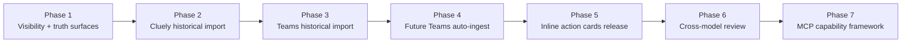

# Advanced Integrations Implementation Plan

Last updated: 2026-04-11

Purpose:
- Prepare the proper implementation path for the next advanced integrations.
- Sequence the work so Natively gets more capable without repeating Prism’s architectural sprawl.
- Keep the context engine, UI visibility, and release discipline aligned.

Related docs:
- `docs\architecture\context-engine-target-state.md`
- `docs\architecture\feature-admission-checklist.md`
- `docs\architecture\microsoft-connectors-spec.md`
- `docs\architecture\prism-shortfalls-and-guardrails.md`
- `docs\product\capability-register.md`
- `docs\product\feature-system-map.md`

## 1. Approved Workstreams

This plan covers:

1. Cluely historical meeting importer
2. Teams historical meeting importer
3. Future Teams recording auto-ingest pipeline
4. Inline action cards in the main widget chat
5. One-click cross-model review in the widget chat
6. Targeted visibility upgrades in Context Hub and meeting history
7. MCP capability framework for future Desktop Commander integration

## 2. Delivery Strategy

The plan is phased on purpose.
We do not want a giant merge where import, actioning, MCP, and UI visibility all change at once.

## 3. Phase Detail

### Phase 1: Visibility And Truth Surfaces

Goal:
- Make the current context engine explain itself before adding heavier ingestion paths.

Implementation:
- add source-health counters to Context Hub
- show last ingest/sync timestamps
- show record counts by source type
- show provenance badges in meetings list and meeting details
- distinguish original vs reconstructed meeting records

Primary outputs:
- improved `Context Hub`
- improved meeting list/detail visibility
- import/run health visible from the UI

Acceptance criteria:
- user can see whether Outlook, Teams, calendar, OCR, profile context, and local meeting memory are active
- user can see how many imported meetings exist by source
- user can see whether a meeting came from live session, Cluely, Teams, or manual import

Why first:
- if we add import and auto-ingest first, the user will not trust what the engine knows

### Phase 2: Cluely Historical Import

Goal:
- one-click discovery and import of prior Cluely meetings into the Natively meetings/memory system

Source strategy:
- local authenticated session from `user.session`
- Cluely conversation endpoints used by the desktop client
- fallback local-cache parsing for metadata if needed

Implementation:
- `discover-cluely-history`
- `preview-cluely-import`
- `run-cluely-import`
- provenance mapping into Natively meeting schema
- fidelity classification:
  - `exact`
  - `reconstructed-summary`
  - `reconstructed-usage`

Acceptance criteria:
- recent Cluely meetings appear in preview with transcript/summary/usage availability flags
- imported meetings land in the same Natively meeting history UI
- imported meetings become retrievable by the context broker
- reconstructed artifacts are marked clearly

Release gate:
- verify against a manual sample of 5-10 meetings before running broader import

### Phase 3: Teams Historical Import

Goal:
- import historically accessible Teams meeting transcripts, recaps, and recordings

Source strategy:
- Teams meeting chat transcript/recap extraction via local Teams bridge
- local recordings from OneDrive synced `Recordings` folder
- fallback local transcription only when native transcript is unavailable

Implementation:
- recent meeting chat discovery
- transcript/recap extraction for accessible chats
- recording scan for locally available meeting recordings
- event/filename matching against calendar
- provenance:
  - `native_teams_transcript`
  - `native_teams_recap`
  - `recording_reconstructed`

Acceptance criteria:
- importer can preview recent Teams meeting artifacts
- importer can ingest at least the meetings that are locally accessible to the user
- stored meetings preserve provenance and fidelity
- imported meetings contribute to prep packets and reactive retrieval

Release gate:
- verify that imported speaker attribution is preserved when native Teams transcript exists

### Phase 4: Future Teams Auto-Ingest

Goal:
- automatically absorb new Teams recordings and transcripts into the context engine without manual import steps

Watched source:
- `C:\Users\sasnahrup\OneDrive - IP-Corporation\Recordings`

Implementation:
- file watcher plus periodic backfill scan
- file stability detection before ingest
- dedupe against already-imported meetings
- calendar correlation
- use native transcript if available
- fall back to recording-only workflow if necessary
- automatic re-index and prep-packet refresh

Acceptance criteria:
- new recording is discovered automatically
- ingest waits until the file is complete
- linked meeting becomes visible in UI with correct provenance
- indexed meeting becomes available to retrieval without manual intervention

Release gate:
- run at least three real-world ingest cases successfully:
  - native transcript present
  - recording only
  - duplicate file / rename case

### Phase 5: Inline Action Cards Release

Goal:
- let widget chat propose real Outlook/Teams/calendar actions inline and execute them safely

Current state:
- backend planning and renderer card implementation exist in repo
- needs runtime verification and release-quality polish

Implementation:
- finish runtime validation in the repo build
- package into installed release
- support explicit send/create buttons only
- surface resolution failures clearly
- log proposal + execution provenance

Acceptance criteria:
- user request in widget chat produces the correct card type
- user can edit before send
- execution result is shown inline
- no silent auto-send behavior occurs

Release gate:
- manual validation for email, Teams, and calendar action flows in the packaged app

### Phase 6: Cross-Model Review

Goal:
- let the user manually send a generated answer or draft through a fixed alternate reviewer model with one click

Why:
- supports "write like me" passes with GPT-5.4
- supports technical cross-checks with Codex
- gives the user a controlled second opinion without turning the product into a multi-agent free-for-all

Implementation:
- add per-message review actions in the widget chat
- support fixed review intents:
  - `voice_pass`
  - `technical_check`
  - `tighten_and_sendable`
- route each intent to a predetermined alternate model
- return the review as a sibling message/card, not a silent overwrite
- allow:
  - `replace original`
  - `keep both`
  - `copy reviewed version`

Guardrails:
- user-triggered only
- one hop only
- no recursive model-to-model review chains
- reviewer model chosen by task type, not by open-ended model debate
- no automatic sending after review

Acceptance criteria:
- user can click review from a generated message
- reviewed result appears inline with clear provenance
- reviewed output is labeled with reviewer model and review intent
- no review loop can recursively trigger itself

Release gate:
- validate at least:
  - GPT-5.4 voice pass on outbound email text
  - Codex technical cross-check on a code/system-design answer
  - GPT-5.4 speakability rewrite on a meeting response

### Phase 7: MCP Capability Framework

Goal:
- prepare for Desktop Commander and future MCP integrations without reintroducing Prism-style tool confusion

Implementation:
- define tool domains:
  - `context`
  - `communication`
  - `filesystem`
  - `research`
  - `system`
- define permission tiers:
  - `read_only`
  - `write_requires_confirmation`
  - `destructive_requires_elevated_confirmation`
- implement planner-to-card-to-executor routing
- restrict surface access by mode

Acceptance criteria:
- no MCP server is dumped raw into the main chat path
- each tool declares domain, confirmation requirement, and allowed surfaces
- Desktop Commander starts in read-only mode

Release gate:
- MCP cannot be enabled until the planner and inline approval path are proven stable

## 4. Work Breakdown By Artifact

### Engineering Specs To Maintain

- `docs\product\capability-register.md`
- `docs\product\feature-system-map.md`
- `docs\architecture\prism-shortfalls-and-guardrails.md`
- `docs\architecture\advanced-integrations-implementation-plan.md`

### New UI Surfaces

- Context Hub source-health enhancements
- meeting provenance badges
- import preview UI for Cluely and Teams
- auto-ingest event log / last-ingest status

### New Backend Components

- Cluely importer service
- Teams history importer service
- Teams recording watcher service
- import provenance mapper
- ingestion scheduler / retry handling
- MCP capability registry

## 5. Evaluation And Test Plan

Every phase should include:

### Retrieval validation

- imported meetings are queryable
- prep packets cite the expected prior meeting context
- stale imported records do not outrank active meeting context improperly

### Fidelity validation

- transcript exists and is readable
- summary provenance is marked correctly
- usage or assistant interactions are either preserved or explicitly reconstructed

### UI validation

- source status is visible
- import results are visible
- errors are visible

### Release validation

- build passes
- packaged app passes
- installed app path behaves identically for user-facing flows

## 6. Recommended Execution Order

This is the order I recommend actually coding:

1. Phase 1 visibility upgrades
2. Phase 2 Cluely importer
3. Phase 3 Teams historical importer
4. Phase 5 inline action cards release
5. Phase 4 Teams auto-ingest
6. Phase 6 cross-model review
7. Phase 7 MCP framework

Reason:
- visibility first makes the rest trustworthy
- Cluely importer has the highest immediate migration value
- Teams historical import unlocks institutional memory
- action cards are already partially implemented
- auto-ingest should wait until manual historical import proves the data model
- cross-model review should be added after the action-card/message plumbing is stable
- MCP should come last because it expands the blast radius if introduced too early

## 7. Definition Of Success

This initiative succeeds if:

- Natively becomes the trusted system of record for your meeting intelligence
- historical Cluely and accessible Teams meeting history can be searched and reused in context
- future Teams recordings flow into the context engine automatically
- communication actions can be initiated from chat safely and clearly
- the architecture remains explainable and mode-specific
- the user can always tell what the system knows, where it came from, and whether it is original or reconstructed
