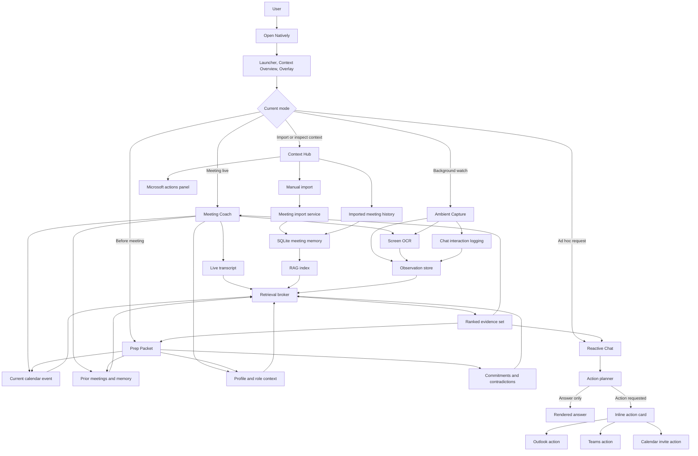
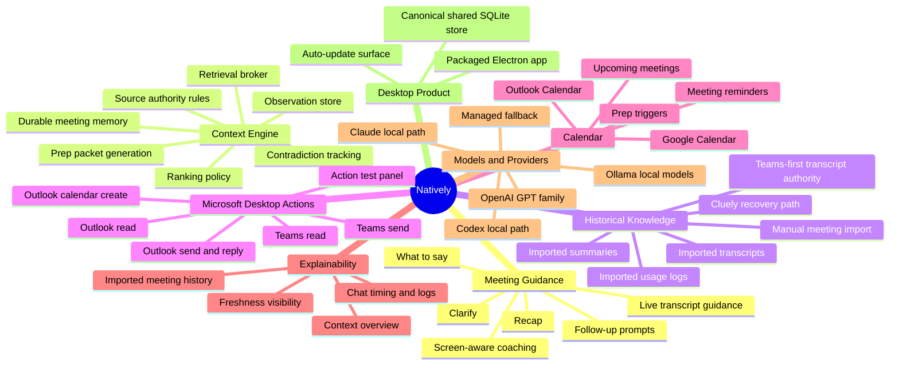
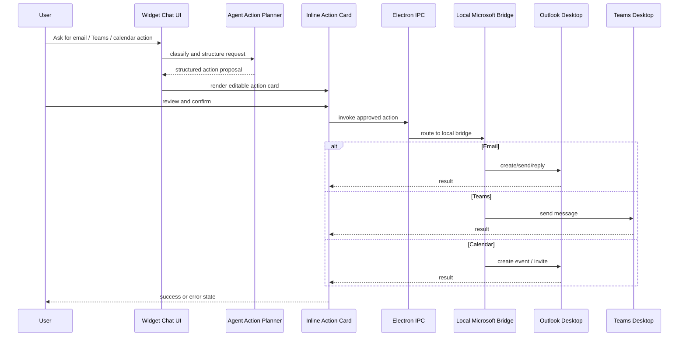
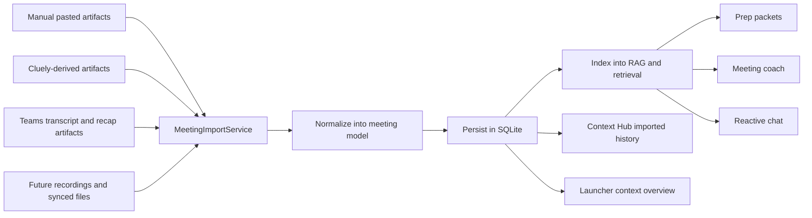
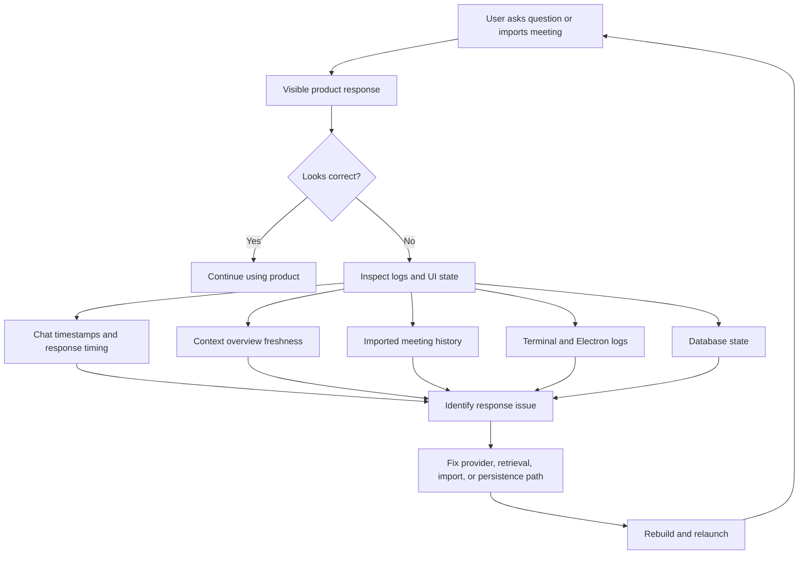

# Natively Feature System Map

Last updated: 2026-04-12

This file is for product explanation, leadership prep, and architecture storytelling.
It is intentionally visual-first.

Each Mermaid block below is mirrored in a standalone `.mmd` file in `docs/product/` so the diagrams can be reused independently.

## 1. End-To-End Runtime Flow

Source: `feature-system-map-1-user-flow.mmd`

## 2. Capability Map

Source: `feature-system-map-2-capability-map.mmd`

## 3. Communication Action Flow

Source: `feature-system-map-3-action-flow.mmd`

## 4. Historical Ingestion And Memory Flow

Source: `feature-system-map-4-ingestion.mmd`

## 5. Diagnostics And Trust Loop

Source: `feature-system-map-5-diagnostics.mmd`

## 6. Suggested Leadership Narrative

Use this framing:

1. Natively observes live work, not just typed prompts.
2. It grounds assistance in ranked context from multiple local and durable sources.
3. It can move from guidance to action through local Outlook and Teams execution surfaces.
4. It is increasingly explicit about source authority, inspectability, and failure handling rather than hiding everything inside prompts.
